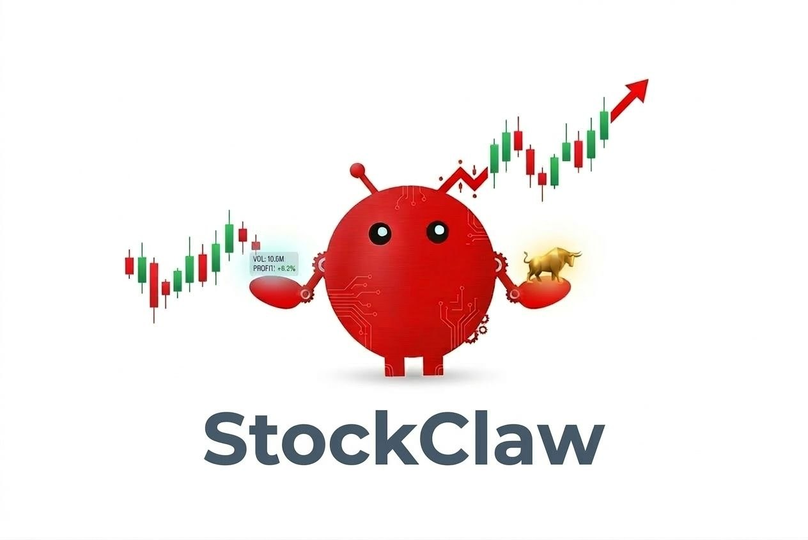
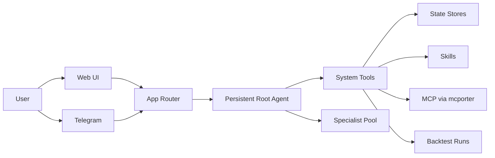

<p align="center">
  
</p>

<h1 align="center">StockClaw</h1>

<p align="center">
  A deeply optimized multi-agent system for stock research, paper trading, historical backtesting, and Telegram delivery.
</p>

<p align="center">
  
  
  
  
  
</p>

<p align="center">
  <a href="#quick-start">Quick Start</a> ·
  <a href="#what-it-does">What It Does</a> ·
  <a href="#architecture">Architecture</a> ·
  <a href="#telegram">Telegram</a> ·
  <a href="#historical-backtesting">Historical Backtesting</a>
</p>

> [!IMPORTANT]
> StockClaw is built around one persistent root agent. The root owns the conversation, decides when to use tools, and only spawns specialists when they add signal.

## What It Does

<table>
  <tr>
    <td width="33%">
      <strong>Deep Stock Research</strong><br>
      One persistent root coordinates multiple professional analysts for valuation, technicals, sentiment, and risk.
    </td>
    <td width="33%">
      <strong>Paper Trading</strong><br>
      Structured paper portfolio truth, explicit execution boundaries, and fully auditable state changes.
    </td>
    <td width="33%">
      <strong>Historical Backtesting</strong><br>
      Frozen datasets, isolated day sessions, strict `T-1` constraints, and agentic context gathering.
    </td>
  </tr>
</table>

## Product Philosophy

- StockClaw is optimized for stock analysis first, not generic chat.
- The root agent stays responsible for the final decision and selectively spawns domain specialists only when they add signal.
- The system does not hard-code vendor-specific market-data structures into the business workflow.
- External data access is pushed to community MCP servers and skills, so the system can evolve without rewriting core trading or backtest logic.
- High-risk actions such as trading, config changes, and durable memory writes stay behind explicit tools and audited state transitions.

## Specialists

StockClaw ships with a built-in specialist pool tuned for equity analysis:

- value analyst
- technical analyst
- news and sentiment analyst
- risk manager
- portfolio agent
- trade executor
- system ops

The root agent sees this pool, picks only the relevant specialists, and synthesizes the final answer.

## Data And Extension Model

StockClaw is designed to avoid baking one provider into the core system.

- Market data, research data, and external integrations are expected to come from community MCP servers and skills.
- You can start with the built-in skills that ship in this repository.
- After StockClaw is running, you can either ask it to help install a new skill or MCP path, or you can add them manually yourself.
- In normal use, prefer asking StockClaw to install MCP entries and skills for you instead of hand-editing repository config files.
- The point is to keep the core system stable while letting data access evolve at the edges.

## Example Use Cases

### 1. Backtest a Portfolio You Already Built

Imagine you have already set up a portfolio, but you do not know whether it would have held up over the last few trading days, and you do not want to manually gather data or analyze every move yourself.

That is exactly the kind of workflow StockClaw is meant to absorb for you. You can simply say something like:

```text
Help me backtest this portfolio for 7 days.
```

Or:

```text
Backtest my current portfolio for the last 7 trading days.
```

StockClaw can prepare the historical window, run the backtest flow, and return the result with trades, drawdown, and performance summary.

> [!CAUTION]
> Keep backtest windows short unless you really need a long run. Longer date ranges consume much more token budget and tool budget, and the system may take significantly longer to finish.

### 2. Find Stocks Worth Studying

If you want fresh ideas instead of testing an existing portfolio, you can ask StockClaw to search for investable names and build a shortlist. For example:

```text
Find a few US stocks with strong investment potential and build me a watchlist.
```

Or:

```text
Find several stocks with good value, technical, and sentiment alignment.
```

In that flow, the root agent can search, gather data, and selectively use specialists to narrow the list into names worth deeper follow-up.

### 3. Deep Analysis on a Single Stock

If you already have one ticker in mind, StockClaw can go deeper instead of giving you a generic summary. For example:

```text
Do a deep analysis on MSFT.
```

Or:

```text
Analyze whether NVDA still has investment value here.
```

This is where the multi-agent structure matters most: the root can combine valuation, technical structure, sentiment, and risk views into one final synthesis instead of forcing you to stitch the reasoning together yourself.

## Why This Layout

- One persistent root keeps ordinary chat continuity stable.
- Specialists are ephemeral and isolated, so analysis can be delegated without polluting the main session.
- High-risk operations stay behind tools and state stores, not free-form agent text.
- Backtesting stays reproducible because execution uses frozen state and `T-1` constrained context reads.
- Telegram, restart handling, runtime reload, and cron automation stay in adapters and services instead of leaking into portfolio logic.

## Quick Start

```bash
git clone https://github.com/24mlight/StockClaw.git
cd stock-claw
npm install
npm start
```

On first startup, the app guides local setup for:

- the single local LLM config file at `config/llm.local.toml`
- optional Telegram integration

If the local MCP config file is missing, the app creates an empty one automatically in the background. The setup wizard does not walk you through MCP server credentials.

For LLM setup, you can choose either path:

- let the startup wizard create `config/llm.local.toml`
- create `config/llm.local.toml` yourself from `config/llm.local.example.toml`

The LLM config uses a single OpenAI-compatible endpoint entry. The only required values are:

- `model`
- `baseUrl`
- `apiKey`

Timeout, context window, and compaction threshold use system defaults unless you add overrides manually.

Telegram is optional:

- choose `no` if you only want the Web UI
- choose `yes` if you want Telegram

If Telegram is enabled, the startup flow is:

1. Paste your bot token
2. Send any message to your bot in Telegram
3. Copy the pairing code from Telegram
4. Paste that code into the local terminal prompt
5. Type `skip` there if you want to finish pairing later

All generated config and runtime state stay local and are ignored by git.

You can also create the local files yourself and manage them manually if you prefer.

Default address:

```text
http://127.0.0.1:8000
```

## What It Loads On Startup

At runtime startup, StockClaw loads:

- local LLM configuration
- local MCP configuration
- installed skills
- prompts
- local memory files for persona, user preferences, tool usage, and investment principles
- persisted runtime state such as sessions, portfolio state, cron jobs, and backtest artifacts

Changes to config, skills, and prompts support watcher-driven reload.

## Architecture



The application layer is only the outer router. The real long-lived conversation owner is the persistent root PI session behind it.

## Core Flows

| Flow | Behavior |
| --- | --- |
| Chat | Root handles the turn, uses tools directly for simple tasks, and spawns specialists only when needed |
| Specialist work | `sessions_spawn` creates isolated ephemeral sessions with profile-specific prompts and tool policies |
| Paper execution | A live quote is resolved, validated, and then used to update structured paper-trading state |
| Backtesting | A job prepares a frozen dataset, runs isolated day sessions, and pushes the final result back to the origin session |
| Telegram | Pairing, reactions, media input handling, file delivery, and chat transport stay inside the Telegram adapter |

## Historical Backtesting

The root agent can run backtests for:

- a single asset
- an explicit portfolio
- the current paper portfolio

Current backtest model:

- wrapper tools queue an async job and return immediately
- prepare discovers a usable historical data path at runtime
- the trading calendar is determined before execution starts
- each trading day runs in an isolated decision session
- day sessions can request additional historical context, but only through constrained backtest tools
- final results are pushed back to the originating session after completion

## Telegram

Telegram is an extension, not the primary UI.

Supported behavior includes:

- local pairing approval
- slash commands for status and portfolio inspection
- reaction support
- file sending
- async backtest result delivery
- inbound text and non-text messages such as images and common media attachments

Current non-text inbound handling is metadata-aware:

- text and captions are preserved
- media-only messages are normalized into a usable request
- attachment summaries are passed into the root context

## Context And Compaction

- Real provider usage is stored after each completed turn and surfaced in `/status`
- Context size and compaction thresholds come from local LLM configuration
- Compaction is the PI session compression step
- Flush is the pre-compaction durable memory write decision
- Cron jobs run in dedicated sessions so chat sessions stay small

## API

<details>
<summary>HTTP endpoints</summary>

- `GET /`
- `GET /health`
- `GET /api/runtime`
- `POST /api/runtime/reload`
- `POST /api/sessions`
- `GET /api/sessions/:id`
- `GET /api/sessions/:id/spawns`
- `POST /api/sessions/:id/messages`
- `GET /api/sessions/:id/status`
- `GET /api/portfolio`
- `PUT /api/portfolio`
- `POST /api/trades/execute`
- `GET /api/config`
- `PATCH /api/config`
- `POST /api/ops/install`

</details>

## Local State

<details>
<summary>Ignored local files and runtime state</summary>

The repository ignores local working state such as:

- local config
- portfolio and session state
- backtest artifacts
- runtime logs
- local memory files

These are machine-local operational files, not repository content.

</details>

## License

StockClaw is released under the MIT License. See [LICENSE](LICENSE).
